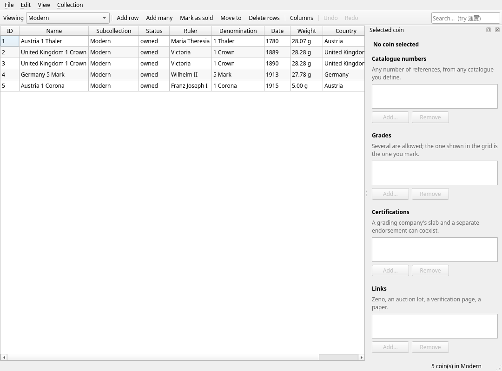
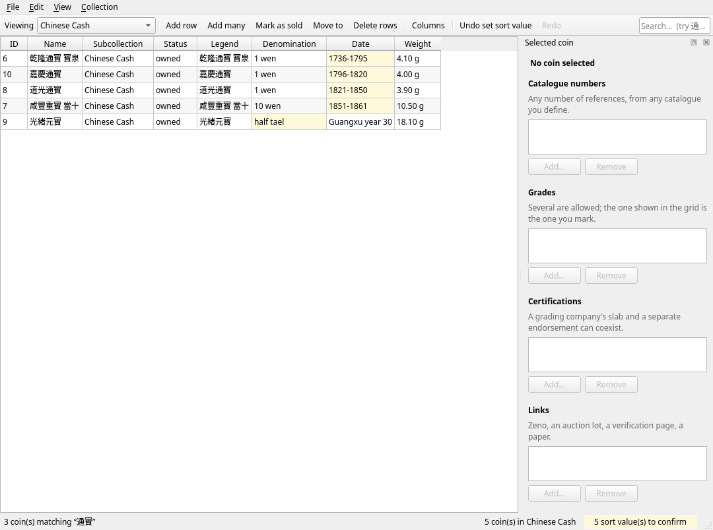
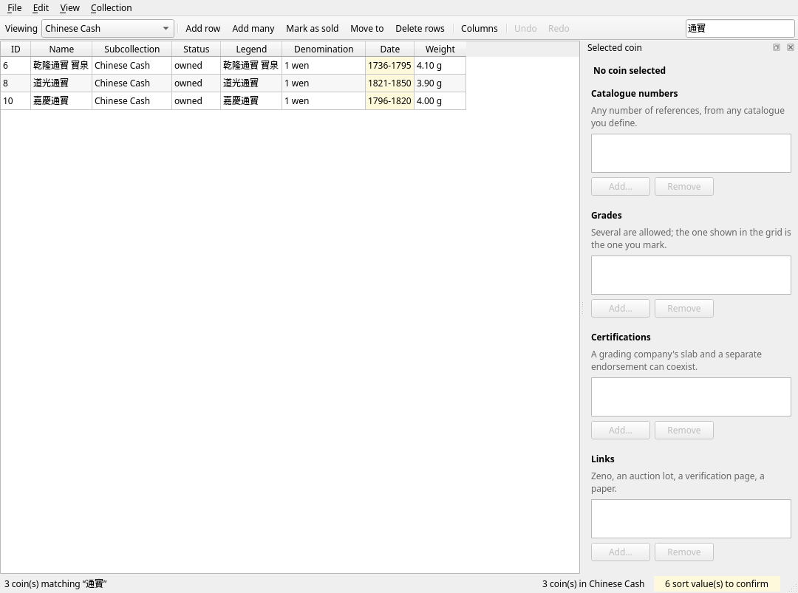
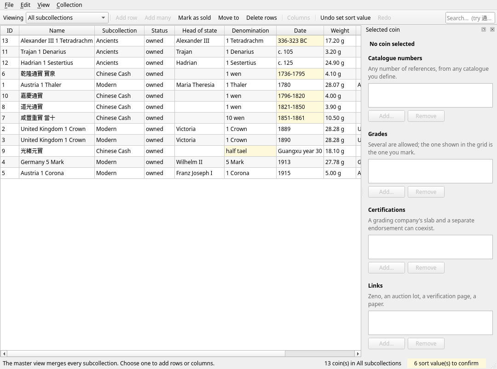
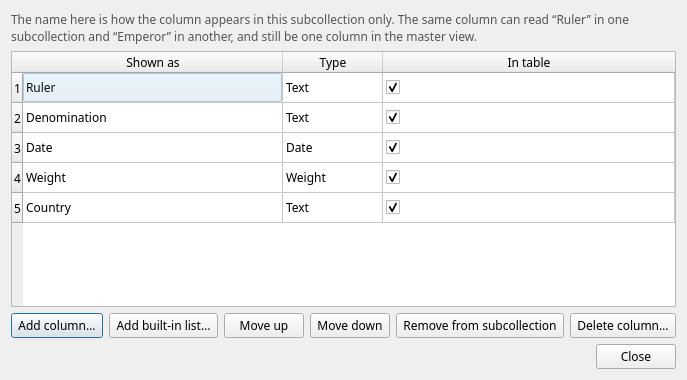
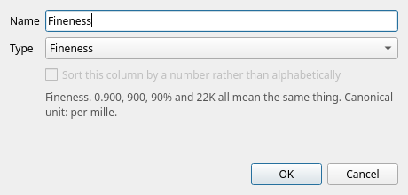
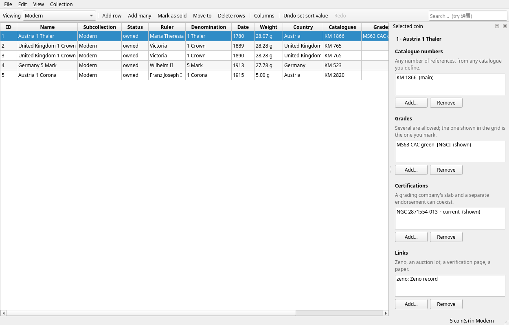
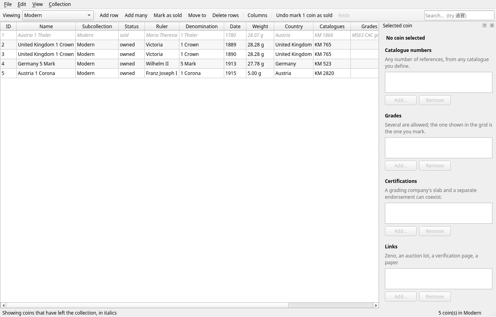

# easylabeldemo

Development repository for an open-source numismatic collection manager. The existing 2×2 holder
label generator (kept in [`legacy/`](legacy/)) becomes one module of this suite; its behaviour is
preserved, not replaced.

The released label tool lives in a separate repository. This one is for building the wider suite.

> Naming note: the product name is undecided. The Python package is currently `numis`, a placeholder.
> Renaming later touches import paths only, never the database schema.

## Layout

| Path | Contents |
|---|---|
| [`docs/design/`](docs/design/) | Design specifications. Start with [`OVERVIEW.md`](docs/design/OVERVIEW.md) for plain English, or [`README.md`](docs/design/README.md) for the document index |
| [`docs/design/schema/base-v1.sql`](docs/design/schema/base-v1.sql) | The normative base schema |
| `src/numis/` | The core library. Imports no GUI toolkit, so it is testable and reusable |
| `src/numis/ui/` | The Qt interface. The only place a GUI toolkit is imported |
| `tests/` | Test suite; `tests/ui/` runs Qt headlessly |
| `tools/` | Development utilities, including the screenshot generator |
| [`legacy/`](legacy/) | The original single-file label generator and its config, unchanged |

## Screenshots

The spreadsheet-style grid. Columns are the ones you defined; the highlighted cells are values
whose sort position was worked out automatically and can be confirmed or changed.



The same window with a different subcollection. Chinese cash coins here, sorted by date — note
that `1736-1795` sorts between 1720 and 1780 rather than alphabetically, and that
`Guangxu year 30` sorts where you told it to.



Searching `通寶` finds it inside longer legends, which needed a specific index design.



The master view merges every subcollection. *Head of state* is one column even though it reads
*Ruler* in one subcollection and *Emperor* in another, because it is the same column. Fields that
only some subcollections use appear as their own columns, blank elsewhere.



Managing columns, and adding one.

 

Catalogue numbers, grades, certifications and links are edited in the panel beside the grid, which
follows the selected coin. The grid shows a one-line summary of each.



A coin marked as sold keeps everything and is listed in italics only when you ask for it.



Screenshots are generated headlessly by `tools/screenshots.py`, so they can be regenerated
rather than going stale.

## Status

Documents 01 (core data model) and 02 (fields and special systems) are **implemented and tested**,
and the **spreadsheet-style interface** is built on top of them: 260 tests, schema verified
equivalent to the normative SQL. Nothing is released and the schema is not yet stable — test
libraries are disposable.

Not yet built: search and filtering beyond full text (document 03), import/export and Numista
(04), wishlists (05), labels driven from the database (06), virtual albums and photographs (07).
The history ledger has no editor yet: purchase and sale prices can be recorded through the core and
the CLI, but not from the interface.

Database migrations are deferred: while the schema is unstable and no real data exists, Alembic
would only add ceremony. It arrives before the first release.

### Spreadsheet behaviours in the grid

| Behaviour | Notes |
|---|---|
| Type straight into cells | No dialog between you and your data |
| Arrow keys and Tab move around | Enter commits and moves down, as a spreadsheet does |
| Copy and paste blocks of cells | Tab-separated, so it works to and from Excel |
| Paste repeats to fill a selection | One value fills a selection; a column repeats sideways |
| Fill down | `Ctrl+D` |
| Clear a selection | `Del` |
| Undo and redo everything | Including pastes and fill-downs, as single steps |
| Sort by clicking a header | Using the sort keys, so `10 wen` follows `1 wen` |
| Reorder, hide and resize columns | Right-click a header |
| Add one row or many | 47 identical coins become 47 rows you can then edit together |
| Delete to a Trash | Recoverable; nothing is destroyed silently |
| Right-click a cell → set its sort value | For dates and text the app could not read |
| Search, including CJK | `通寶` matches inside `乾隆通寶` |
| Edit the ID, Name and Subcollection columns | Typing another subcollection's name moves the coin |
| Move several coins at once | **Move to…** on the toolbar, or the cell context menu |
| Mark coins as sold | Kept with their history, hidden until *View → Show sold and disposed* |
| Edit catalogue numbers, grades, certifications and links | In the panel beside the grid, for the selected coin |

Rejected edits explain themselves in the status bar and never enter the undo history: entering
`5 stone` in a weight column reports *unknown mass unit 'stone'* and leaves the cell alone.

### What works today

- A library is an empty folder you create; it ships with **no** catalogues, grading scales or
  fields, and you build what you use
- User-defined columns from 13 field types, with units (grams, millimetres, fineness, angles) and
  exact integer money
- Coin dates that accept `1943`, `1736-1795`, `c. 350 BC`, `AH 1256`, `1930s`, `18th century` or
  something unreadable — sorting numerically either way, and saying when it guessed
- Subcollections with per-subcollection labels for a shared column, merging into one master view
- Catalogue numbers that sort like a catalogue reads, with ranges
- Grades from any number of user-defined standards on one comparable axis, with `Details` sorting
  beside its base grade and stickers nudging within it
- Multiple concurrent certifications and a crack-out/regrade history
- An append-only purchase ledger, with cost, proceeds and profit derived rather than typed
- Every coin gets an identifier automatically, editable, unique, and never reused
- A coin's subcollection can be changed at any time, keeping all of its values
- Bulk add and bulk edit
- Full-text search that works for two-character CJK terms and folds diacritics

## Setting up on Windows with VS Code

Do this **once**. After that, updating is one command and there is nothing to reinstall.

Use `git clone`, not the *Download ZIP* button: a downloaded ZIP is a new folder every time, so
the libraries you installed into the previous one are gone and you end up installing repeatedly.

In PowerShell:

```powershell
git clone https://github.com/deathnightdubs/easylabeldemo.git
cd easylabeldemo
py -3.12 -m venv .venv
.venv\Scripts\pip install -e ".[dev]"
```

Then open the folder in VS Code (`code .`) and pick the interpreter: **Ctrl+Shift+P** →
*Python: Select Interpreter* → the one inside `.venv`. VS Code usually finds it on its own and
remembers it for the folder.

Press **F5** and choose *Run: collection manager*. There is also *Create Demo.numis (sample data)*
if you want something to click on straight away — a brand new library is deliberately empty.

### Updating later

```powershell
git pull
```

That is all. The install is an *editable* one, meaning it points at the source folder rather than
copying it, so new code takes effect immediately. Only re-run the `pip install` line if the
dependencies in `pyproject.toml` change — and re-running it is harmless either way.

To try a branch that has not been merged yet:

```powershell
git fetch origin
git switch fix/grid-functionality
```

`git switch main` returns you to the main line.

### If `py -3.12` is not found

Check what you have with `py --list`. Any Python 3.11 or newer works — substitute it, for example
`py -3.13 -m venv .venv`. If the `py` launcher is missing entirely, install Python from
python.org and tick *Add python.exe to PATH*.

## Development

```bash
python3.12 -m venv .venv
.venv/bin/pip install -e ".[dev]"
.venv/bin/pytest
.venv/bin/ruff check src tests
```

VS Code tasks are provided for the same things: **Ctrl+Shift+P** → *Tasks: Run Task* →
*Run tests*, *Lint*, or *Install dependencies*.

Run the interface:

```bash
python -m numis.ui                        # asks for a library folder
python -m numis.ui ~/MyCollection.numis   # or open one directly
```

Pointing it at a folder that does not exist yet creates an empty library there.

There is also a command line, which exists to prove the core works without an interface:

```bash
python -m numis demo ~/Demo.numis         # a small library exercising the awkward cases
python -m numis info ~/Demo.numis
python -m numis list ~/Demo.numis --sort date_issued
python -m numis list ~/Demo.numis --subcollection ancients
```

Regenerate the screenshots (no display needed):

```bash
QT_QPA_PLATFORM=offscreen python tools/screenshots.py docs/images
```

## Design principles

1. **Local first.** The collection lives in a folder on your machine. No account, no cloud, works
   offline.
2. **The user owns the schema.** Columns are user-defined. Nothing is undeletable, and features are
   *told* which field to use rather than inferring it.
3. **Core is separate from UI.** `src/numis/` never imports Qt, so the same logic serves a GUI, a
   CLI and the tests.
4. **Nothing is destroyed quietly.** Removal archives by default; the purchase ledger is
   append-only; permanent deletion is explicit and states what will be lost.
5. **Warn, do not block.** The database enforces structural integrity only. Judgements about
   plausible data become warnings, never refusals at save time.
